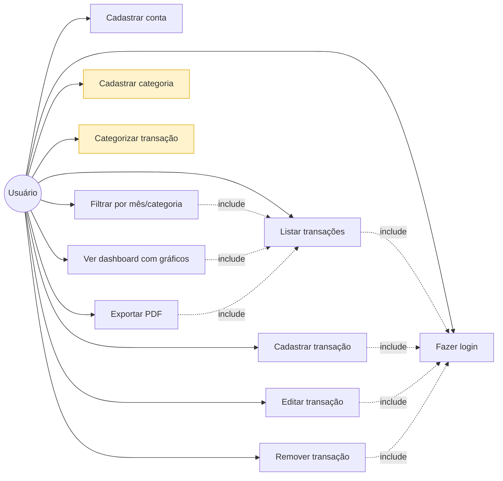
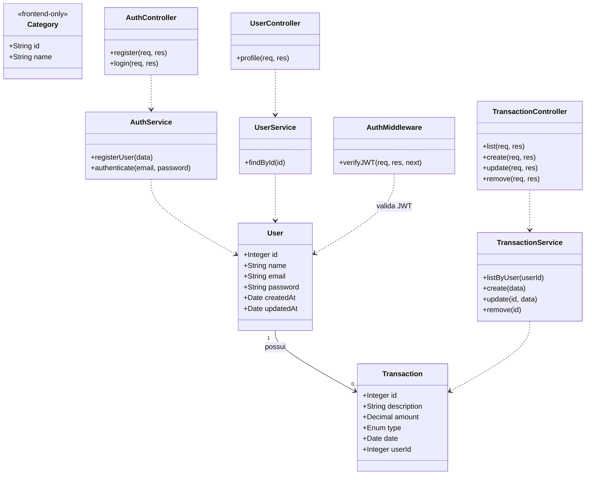
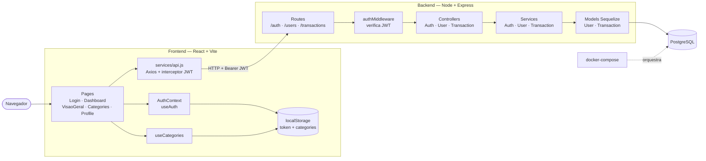

# Diagramas UML — Finanças Pessoais

Documentação preliminar do sistema em UML, em formato Mermaid (markdown). Cada diagrama responde uma pergunta diferente sobre o sistema:

| # | Diagrama | Pergunta que responde |
|---|----------|------------------------|
| 1 | Casos de Uso | O que o sistema faz, do ponto de vista do usuário? |
| 2 | Classes | Quais são as entidades e como elas se relacionam? |
| 3 | Componentes / Arquitetura | Como front, back e banco se conectam? |

> Os mesmos diagramas estão embutidos no `README.md` para visualização direta na home do repositório no GitHub.

---

## 1. Diagrama de Casos de Uso

Mostra as funcionalidades disponíveis para o usuário e dependências entre elas (`include`). Casos em amarelo são **client-side apenas** (vivem em `localStorage` no navegador, sem persistência no backend hoje).

**Legenda**:
- Setas contínuas: associação ator–caso de uso.
- Setas tracejadas `include`: o caso de origem depende do caso de destino (ex.: para listar transações é preciso estar logado).
- Amarelo: caso de uso ainda **não persistido no backend** — implementado apenas no frontend via `localStorage`.

---

## 2. Diagrama de Classes

Modelo de dados e principais classes da aplicação organizadas por camada (Controller → Service → Model). `Category` aparece como `<<frontend-only>>` porque não há entidade equivalente no backend.

**Legenda**:
- `1 — 0..*`: relacionamento de cardinalidade (um usuário possui várias transações).
- Setas tracejadas (`..>`): dependência (uma classe usa outra).
- `<<frontend-only>>`: estereótipo indicando que a classe vive apenas no cliente.

---

## 3. Diagrama de Componentes / Arquitetura

Mostra os módulos do sistema e como eles se comunicam. O frontend conversa com o backend via HTTP + JWT; o backend persiste em PostgreSQL via Sequelize; categorias e token ficam em `localStorage` do navegador.

**Legenda**:
- Caixas com cantos retos: componentes de software.
- Cilindros: armazenamento (banco ou `localStorage`).
- Setas contínuas: fluxo de chamada/dependência.
- Setas tracejadas: orquestração de infraestrutura.
- O JWT é injetado automaticamente em todas as requisições autenticadas pelo interceptor do Axios em `frontend/src/services/api.js`.
