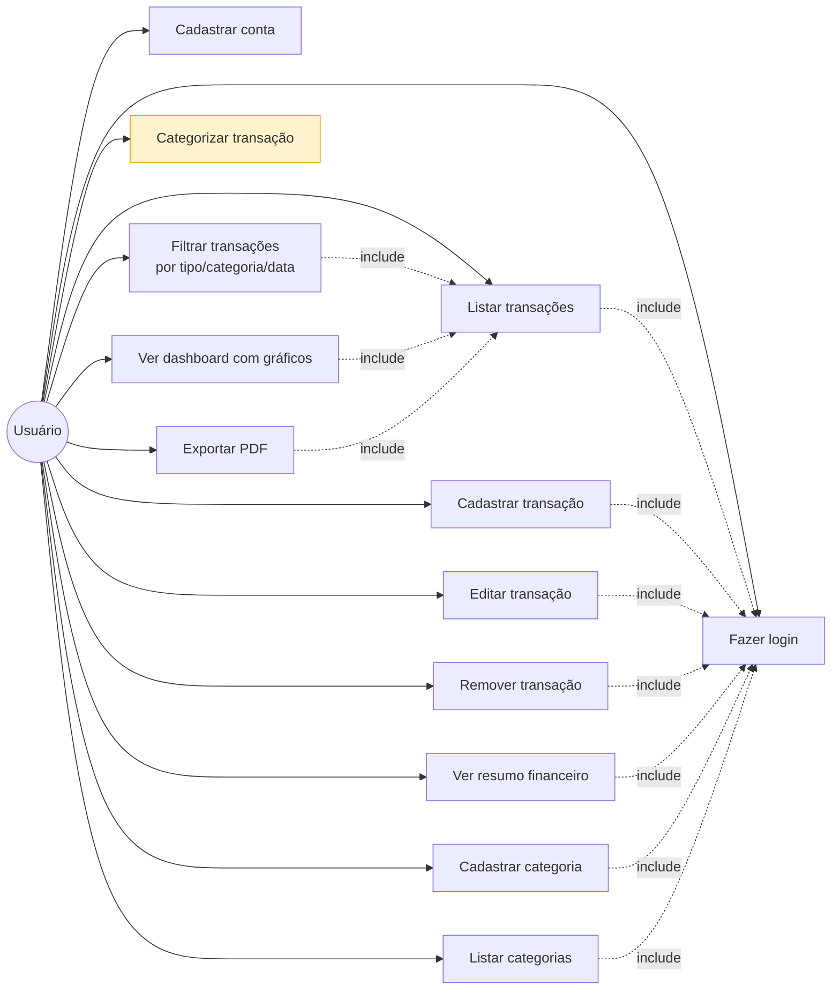
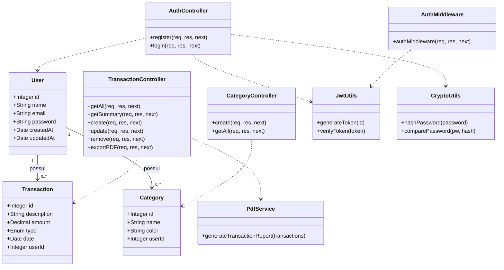
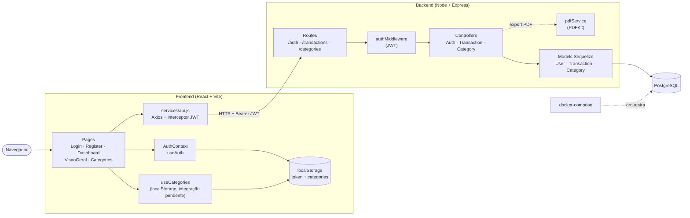

# Diagramas UML — Finanças Pessoais

Documentação preliminar do sistema em UML, em formato Mermaid (markdown). Cada diagrama responde uma pergunta diferente sobre o sistema:

| # | Diagrama | Pergunta que responde |
|---|----------|------------------------|
| 1 | Casos de Uso | O que o sistema faz, do ponto de vista do usuário? |
| 2 | Classes | Quais são as entidades e como elas se relacionam? |
| 3 | Componentes / Arquitetura | Como front, back e banco se conectam? |

> Os mesmos diagramas estão embutidos no `README.md` para visualização direta na home do repositório no GitHub. PNGs renderizados em `docs/uml/`.

---

## 1. Diagrama de Casos de Uso

Mostra as funcionalidades disponíveis para o usuário e dependências entre elas (`include`). O caso em amarelo (**Categorizar transação**) está marcado como *integração pendente*: a entidade `Category` já existe no backend (`/api/categories`), mas o frontend ainda usa `localStorage` no `useCategories` e ainda não vincula `categoryId` nas transações via API.

**Legenda**:
- Setas contínuas: associação ator–caso de uso.
- Setas tracejadas `include`: o caso de origem depende do caso de destino (ex.: para listar transações é preciso estar logado).
- Amarelo: caso de uso com **integração frontend–backend pendente**.

---

## 2. Diagrama de Classes

Modelo de dados e principais classes do backend. Após a refatoração do main, **não há mais camada de Services geral**: controllers chamam os Models do Sequelize diretamente. O único service remanescente é o `PdfService`, dedicado à geração do relatório em PDF.

**Legenda**:
- `1 — 0..*`: cardinalidade (um usuário possui várias transações e várias categorias).
- Setas tracejadas (`..>`): dependência (uma classe usa outra).
- Não há classes `*Service` para auth/user/transaction — esses controllers conversam com Sequelize diretamente.

---

## 3. Diagrama de Componentes / Arquitetura

Mostra os módulos do sistema e como eles se comunicam. O frontend conversa com o backend via HTTP + JWT; o backend persiste em PostgreSQL via Sequelize; o `pdfService` é invocado apenas pelo `TransactionController` no fluxo de exportação. `useCategories` no frontend ainda lê/escreve em `localStorage` (a integração com `/api/categories` está pendente).

**Legenda**:
- Caixas com cantos retos: componentes de software.
- Cilindros: armazenamento (banco ou `localStorage`).
- Setas contínuas: fluxo de chamada/dependência.
- Setas tracejadas: orquestração de infraestrutura ou caminho secundário (geração de PDF).
- O JWT é injetado automaticamente em todas as requisições autenticadas pelo interceptor do Axios em `frontend/src/services/api.js`.
