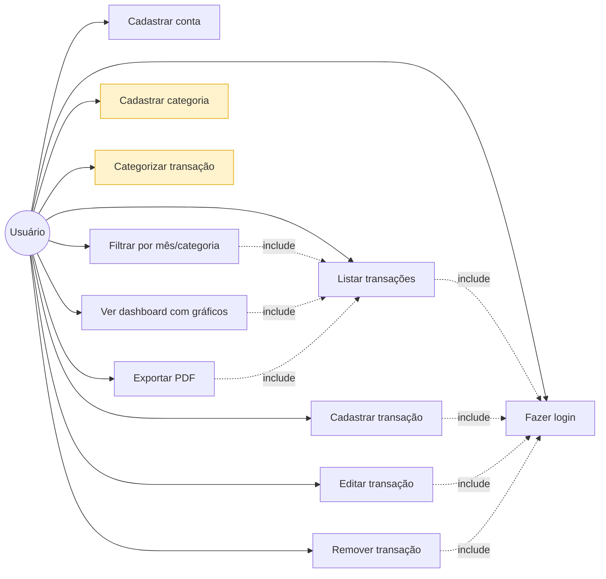
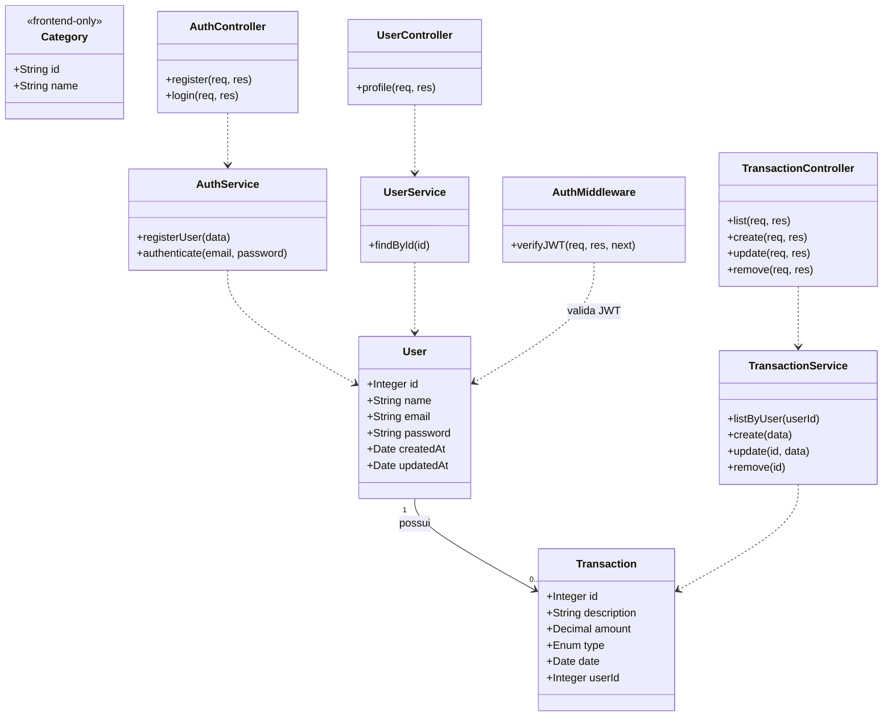
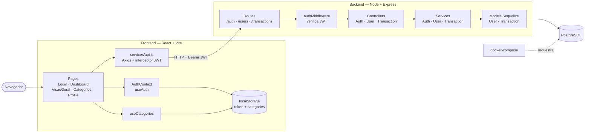

# Finanças Pessoais

Sistema web para gerenciamento de finanças pessoais.

## Tecnologias

**Frontend**
- React 18 + Vite
- React Router DOM v6
- Styled Components
- Axios

**Backend**
- Node.js + Express
- Sequelize ORM + PostgreSQL
- JWT para autenticação
- bcryptjs para hash de senhas

## Estrutura

```
project-root/
├── frontend/        → React app (porta 3000)
├── backend/         → API REST (porta 5000)
├── docker-compose.yml
└── README.md
```

## Como rodar

### 1. Banco de dados (Docker)
```bash
docker-compose up -d
```

### 2. Backend
```bash
cd backend
npm install
npm run dev
```

### 3. Frontend
```bash
cd frontend
npm install
npm run dev
```

## Rotas da API

| Método | Rota                    | Descrição              | Auth |
|--------|-------------------------|------------------------|------|
| POST   | /api/auth/register      | Cadastro de usuário    | Não  |
| POST   | /api/auth/login         | Login                  | Não  |
| GET    | /api/users/profile      | Perfil do usuário      | Sim  |
| GET    | /api/transactions       | Listar transações      | Sim  |
| POST   | /api/transactions       | Criar transação        | Sim  |
| DELETE | /api/transactions/:id   | Remover transação      | Sim  |

## Variáveis de ambiente (backend/.env)

```env
PORT=5000
DB_HOST=localhost
DB_PORT=5432
DB_NAME=financas_db
DB_USER=postgres
DB_PASS=postgres
JWT_SECRET=sua_chave_secreta_aqui
```

## Diagramas UML

Documentação preliminar do sistema em UML (Mermaid). Versão estendida e legendada em [`DIAGRAMAS_UML.md`](./DIAGRAMAS_UML.md).

### 1. Casos de Uso

Funcionalidades do ponto de vista do usuário. Casos em amarelo (categorias) são **client-side apenas** — vivem em `localStorage`, sem persistência no backend.



### 2. Classes

Modelo de dados e principais classes por camada (Controller → Service → Model). `Category` é `<<frontend-only>>` (não há entidade no backend).



### 3. Componentes / Arquitetura

Como os módulos se comunicam: frontend ↔ backend via HTTP + JWT; backend ↔ PostgreSQL via Sequelize.



## 📌 Histórias de Usuário

### Autenticação
- Como um usuário, quero **fazer login no sistema** para acessar minhas finanças pessoais.

### Transações
- Como um usuário, quero **cadastrar uma transação** para registrar meus ganhos e gastos.
- Como um usuário, quero **editar uma transação** para corrigir informações incorretas.
- Como um usuário, quero **remover uma transação** para excluir registros indesejados.
- Como um usuário, quero **visualizar o histórico de transações** para acompanhar minhas movimentações financeiras.

### Filtros e Organização
- Como um usuário, quero **filtrar transações por mês, valor ou categoria** para encontrar informações específicas.
- Como um usuário, quero **categorizar minhas transações** para organizar melhor minhas finanças.
- Como um usuário, quero **cadastrar novas categorias** para personalizar a organização dos meus dados.

### Dashboard
- Como um usuário, quero **visualizar um dashboard financeiro** para ter uma visão geral das minhas finanças.
- Como um usuário, quero ver **o total de gastos** para controlar minhas despesas.
- Como um usuário, quero ver **o total de recebimentos** para acompanhar minha renda.
- Como um usuário, quero visualizar **gráficos (pizza e linha do tempo)** para entender melhor meus hábitos financeiros.

### Exportação
- Como um usuário, quero **exportar minhas transações em PDF** para compartilhar ou guardar meus dados.
